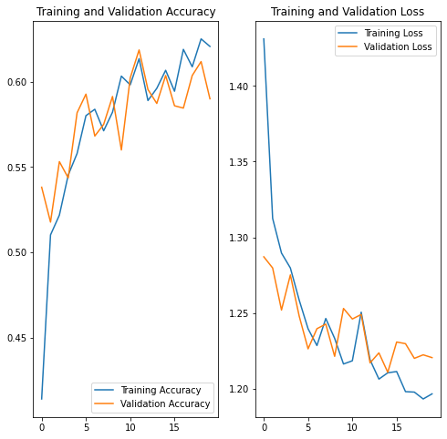

# Codebase:2021

Artificial intelligence, sometimes called machine intelligence, is intelligence demonstrated by machines, unlike the natural intelligence displayed by humans and animals.

In the twenty-first century, AI techniques have experienced a resurgence following concurrent advances in computer power, large amounts of data, and theoretical understanding; and AI techniques have become an essential part of the technology industry, helping to solve many challenging problems in computer science, software engineering and operations research.

### Welcome to my GitHub repository

Here you will find some of my machine Learning based solution notebooks for Natural Language Processing & Understanding, Time Series, Computer Vision and everything in between.

---

## Codebase

### Natural Language Understanding

Text classification (a.k.a. text categorization or text tagging) is the task of assigning a set of predefined categories to an open-ended text.

- [IMDb Moview Review Classification Using Convolutions](natural-language-undestanding/text-classification-using-convolutions.ipynb)

An embedding is a mapping of a discrete — categorical — variable to a vector of continuous numbers. In the context of neural networks, embeddings are low-dimensional, learned continuous vector representations of discrete variables.

- [Word Embeddings - Skip Gram Model](natural-language-undestanding/skip-gram-word2vec-model.ipynb)
- [Training Embeddings from Scratch or Using Pre-trained Embeddings](natural-language-undestanding/training-from-scratch-or-use-pre-trained-embeddings.ipynb)

<!-- ### Time Series

A time series is a series of data points indexed (or listed or graphed) in time order.

- [Sales Forecasting](time-series/)

### Structured Data

Predictive analytics is the branch of the advanced analytics which is used to make predictions about unknown events using tabulated data points.

- [Customer Churn Prediction](structured-data/)
- [Customer Lifetime Value Prediction](structured-data/) -->

### Computer Vision

Image classification (a.k.a. image categorization) is the task of assigning a set of predefined categories/labels to a groups of pixels or an image.

- [Flower Classification with Data Augmentation](computer-vision/image-classification-with-data-agumentation.ipynb)

### TensorFlow 2 API

TensorFlow is a free and open-source software library for machine learning. It can be used across a range of tasks but has a particular focus on training and inference of deep neural networks. Tensorflow is a symbolic math library based on dataflow and differentiable programming.

- [Sequential API](tensorflow2-api/sequential-model-api.ipynb)
- [Functional API](tensorflow2-api/functional-model-api.ipynb)
- [Train and Evaluate Model](tensorflow2-api/train-and-evaluate-model.ipynb)
- [Writing Custom Layers and Models](tensorflow2-api/writing-new-layers-and-models-via-subclassing.ipynb)
- [Model Run Customizations](tensorflow2-api/model-run-customizations.ipynb)

